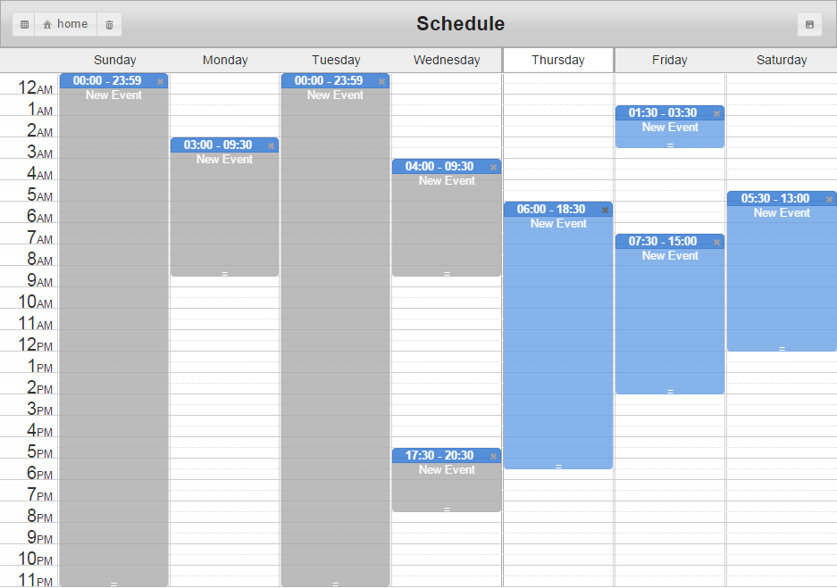

# Schedule
<h3>Description</h3>
    Schedule Project is a job scheduling which can store daily schedule easily
<h3>Snap Shot</h3>
    
<h3>Live Demo</h3>
   <a href="/videojs/video.js/fork">&nbsp;&nbsp; Demo Website</a>
<h3>Quick Start</h3>
   <pre><code>$ cd your_repo_root/repo_name
$ git fetch origin
$ git checkout gh-pages
  </code></pre>
